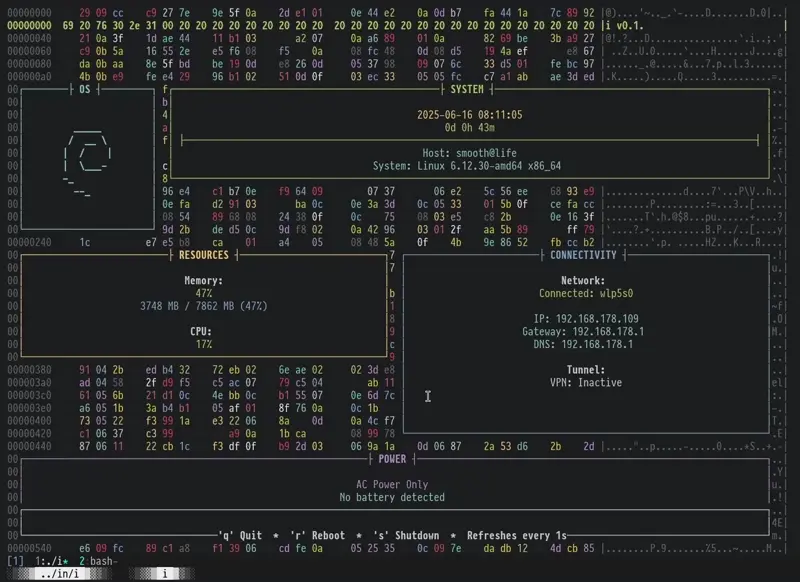

# i

A minimalist system information utility with a hex dump aesthetic.

## Description

"i" is a lightweight terminal-based system information tool that displays
system stats in an immersive hex editor style interface. It shows real-time
information about your system including time, uptime, memory usage, CPU usage,
network status, battery status, and VPN connectivity.

## Features

* Real-time system monitoring
* Hex dump background (cause why not) 
* Battery status detection
* Network interface monitoring
* VPN status detection
* Power controls (reboot/shutdown)
* Adaptive terminal width layout
* Small, hackable Codebase

## Requirements

* C99 compiler
* termbox2 library
* POSIX-compliant system

## Installation

Edit config.mk to match your local setup (i is installed into
the /usr/local namespace by default).

Afterwards enter the following command to build and install i
(if necessary as root):

    make clean install

## Configuration

The configuration of i is done by creating a custom config.h
and (re)compiling the source code.

## Controls

* `q` or `ESC` - Quit
* `r` - Reboot system  
* `s` - Shutdown system

## Credits

Uses termbox2 for terminal UI rendering.
